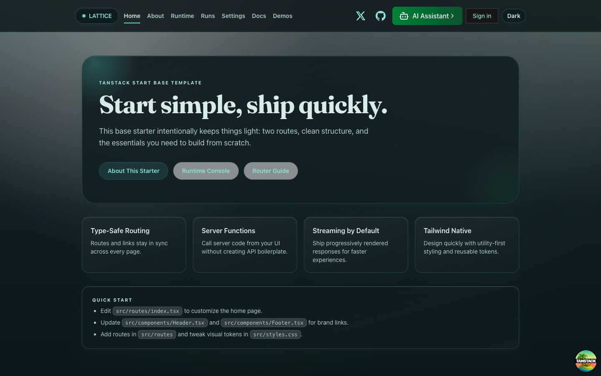
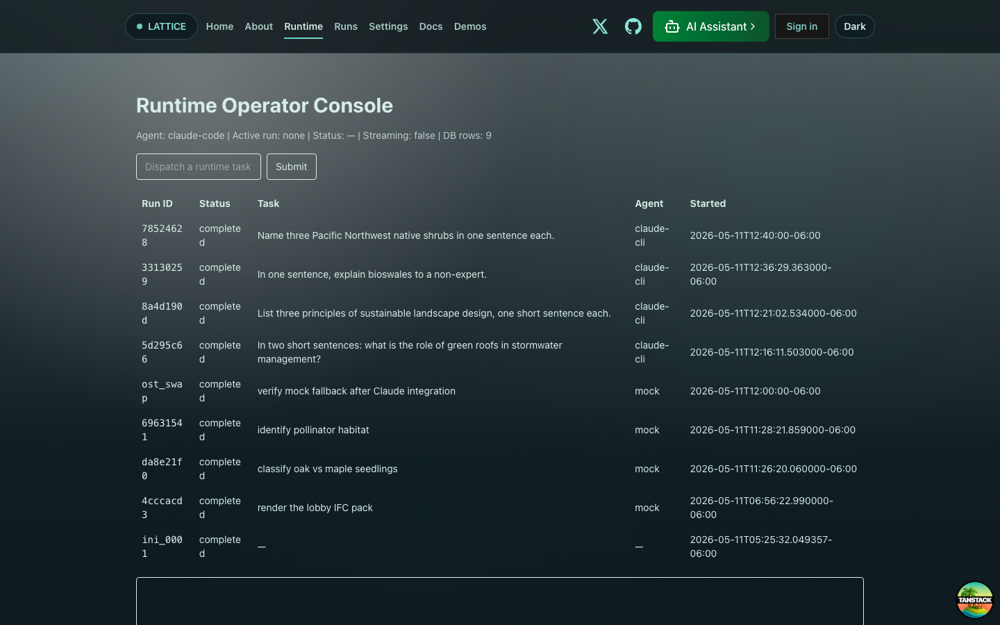
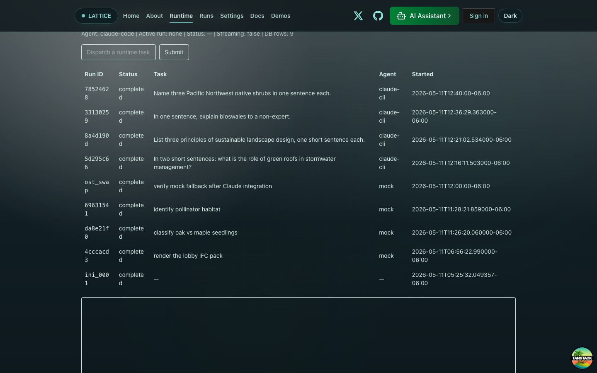
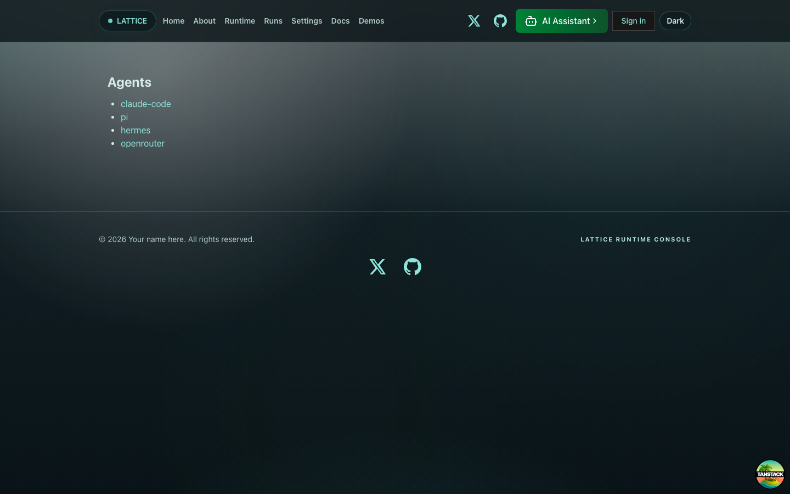
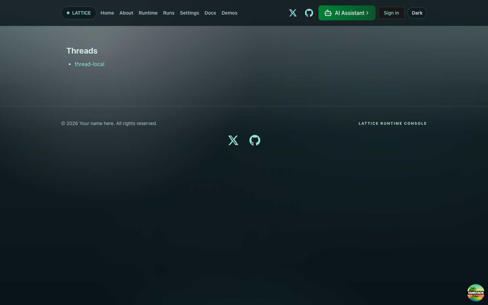
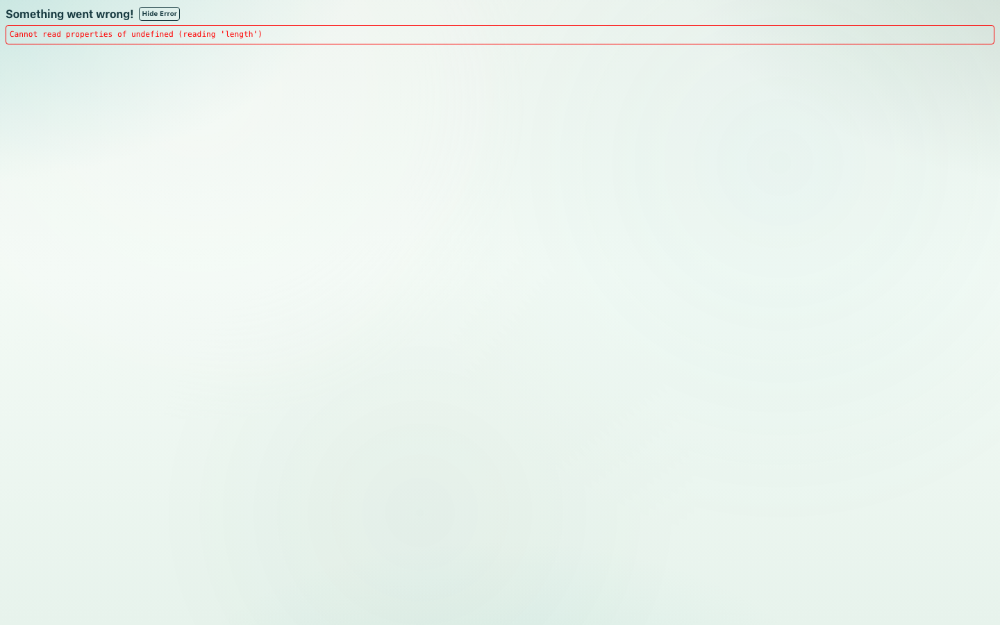
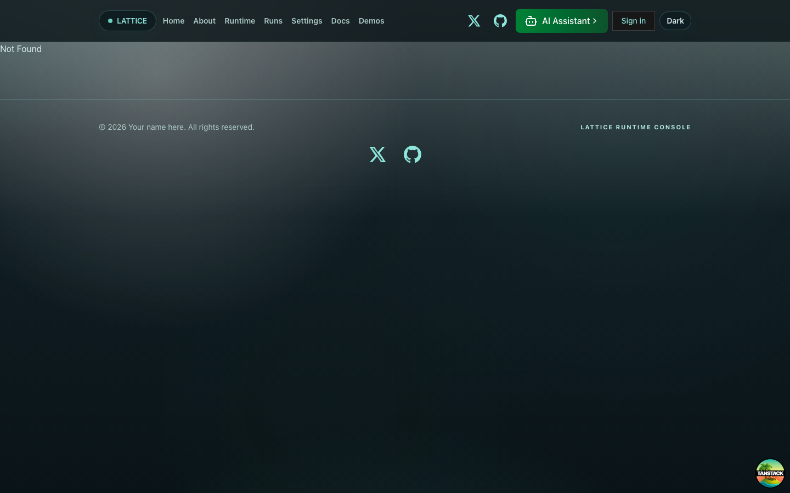
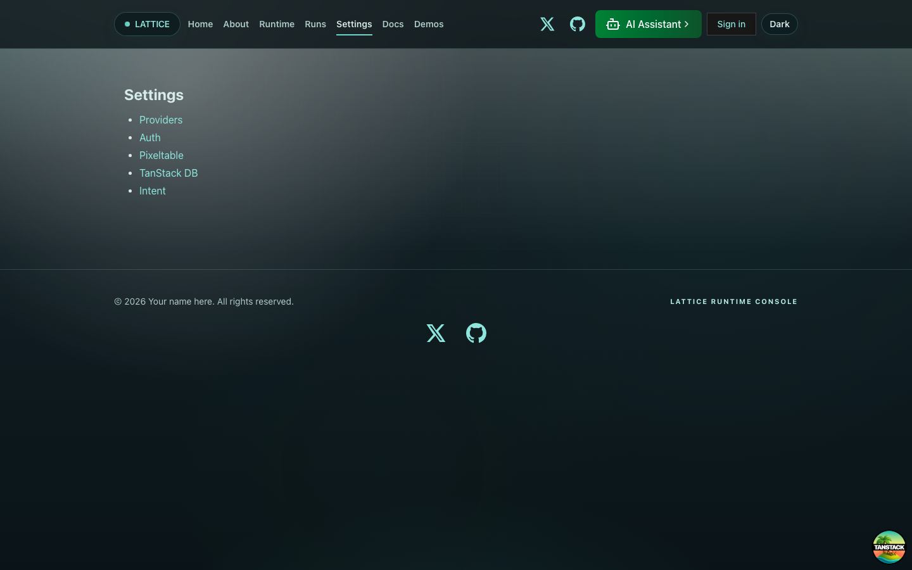

# LATTICE Console — UI Screenshots

Regenerate with `bun scripts/screenshot-all-routes.ts` after starting the sidecar (`make sidecar-up-tcp`) and dev server (`bun run dev`). Each shot is a 1440×900 viewport capture at the route's initial render + 2 s for SSR hydration.

> **What's "implemented" vs "placeholder"**
> "Implemented" = the page renders a working feature against real data.
> "Placeholder" = the route exists and renders, but is either scaffold-only or has no data-binding yet (it's already tracked in `meta/FEATURE_BACKLOG.md` and as an open GitHub issue).

---

## `/` — Home

Landing page. Branded LATTICE pill in the header, kicker, and call-to-action card pointing at the Runtime Operator Console. **Status:** placeholder — content is mostly the TanStack Start starter template; the brand strings have been replaced but the marketing copy hasn't.

---

## `/runtime` — Runtime Operator Console (top of page)

The functional core of the platform. **Status:** fully implemented end-to-end.

- Status line: `Agent | Active run | Status | Streaming | DB rows`
- "Dispatch a runtime task" form → `dispatchRun` server fn → POST `/v1/runtime/events` (status: pending)
- Worker picks it up within 1 s, transitions to `running`, spawns `claude -p --output-format stream-json --include-partial-messages`
- Runs table is fed by the route loader (`runsQueryOptions.ensureQueryData` server-side) so SSR rendering already has rows
- Each row is clickable — sets `activeRunId` and re-subscribes the EventSource for that run
- Run IDs are truncated to the last 8 chars; full ID on hover via `title` attribute

---

## `/runtime` (scrolled to bottom) — EventTimeline + AgentUI

Below the runs table sit the `EventTimeline` (virtualized list of `stream.delta` events for the active run) and the `AgentUI` panel (a `@tanstack/ai` chat surface — not yet wired to the agent runtime). **Status:**
- EventTimeline: implemented. Fed by `useStreamEvents(activeRunId)` over Server-Sent Events from `GET /v1/runtime/stream-events/sse`. Historical events replay on connect; live token deltas push in real time.
- AgentUI panel: scaffolded but currently shows a placeholder. Wiring it to the agent runtime is on the backlog.

---

## `/runs` — Runs index

**Status:** placeholder. The route renders the shared layout but has no list view yet. Today the Runs table on `/runtime` is the canonical list. A dedicated `/runs` page with filters (status, agent, date range) is on the backlog.

---

## `/agents` — Agents index

**Status:** placeholder. The route returns 200 because `agents/index.tsx` exists, but it doesn't yet render the agent-kind directory. Will list the registered agent kinds (`claude-cli`, `mock`, future `claude-api`, `openrouter`) with their config and last-run stats.

---

## `/threads` — Threads index

**Status:** placeholder. Maps to `lattice/execution/agent_threads` once populated. The dispatchRun flow currently uses a hard-coded `thread-local` thread ID — a real threading model is open work.

---

## `/evidence` — Evidence ledger

**Status:** placeholder. The Pixeltable tables `lattice/bridge/evidence/promotion_events` and `lattice/bridge/evidence/harness_run_refs` exist; the page will surface artifact rows, manifests, and the harness_run_refs join.

---

## `/replay` — Run replay (HTTP 404 at the bare URL)

**Status:** scaffold for `/replay/$runId` only. The bare `/replay` URL 404s because there's no `index.tsx` under that route — by design. To use it today, navigate to `/replay/<runId>`. A list-of-replayable-runs index page is on the backlog.

---

## `/settings` — Settings

**Status:** placeholder. Better Auth is wired in `__root.tsx` but the user-facing settings panes (providers, auth, pixeltable, db, intent) are stubs. Each pane is queued as an `operator-console` backlog item.

---

## How the script works

`scripts/screenshot-all-routes.ts` runs preflight checks against the sidecar and dev server, launches headless Chromium via Playwright at 1440×900, loads each route with `waitUntil: 'domcontentloaded'`, waits 2 s for SSR hydration to settle, and writes a PNG per route plus `_summary.json` for downstream tooling.

We use `domcontentloaded` instead of `networkidle` because the operator console keeps a long-lived `EventSource` open for stream events — `networkidle` would never resolve.
