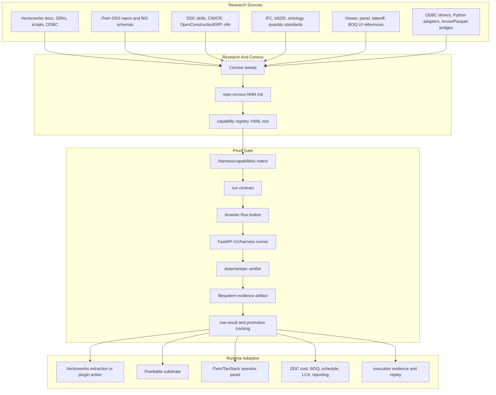
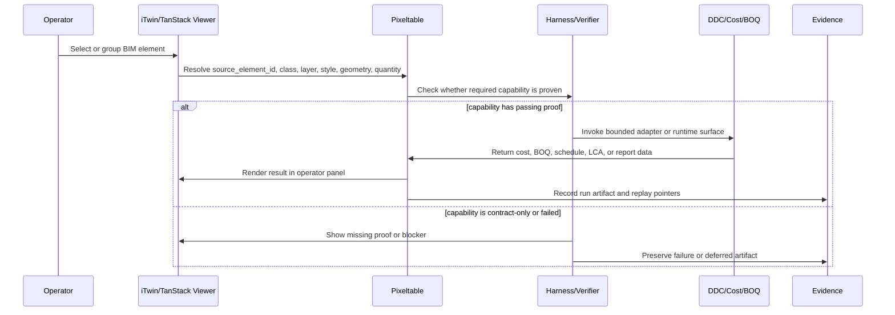
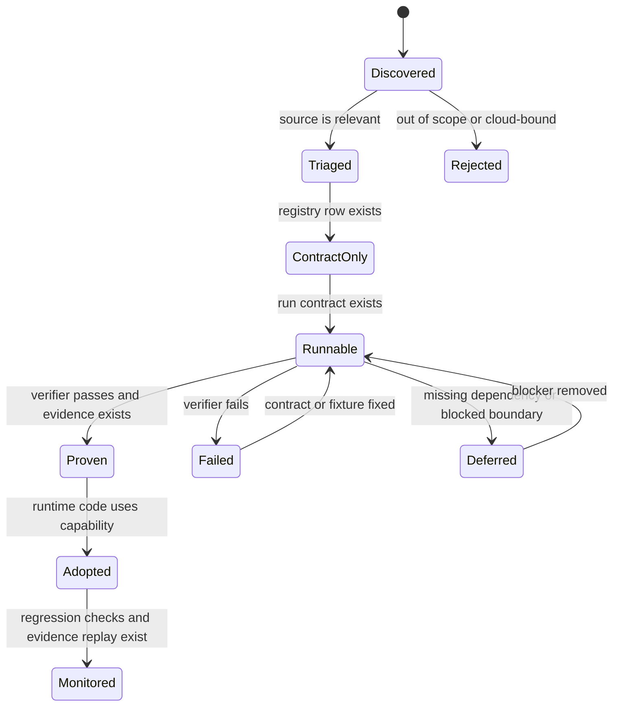
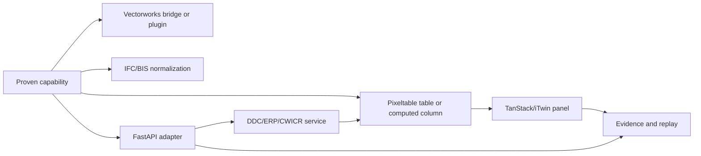

# Capability Research Architecture

Date: 2026-05-13
Status: active architecture note
Owner: LATTICE architecture docs

This document explains how LATTICE harvests external capabilities, turns them
into proof-backed contracts, and eventually uses them inside the
Vectorworks -> Pixeltable -> iTwin/TanStack -> DDC operator workflow.

This is intentionally outside `meta/harness/`. The harness proves capability
claims, but the capability research system is broader than the harness. It is a
LATTICE architecture concern.

## Executive Summary

The capability matrix is not the product. It is the trust gate.

LATTICE is building a landscape architecture data bus:

```text
Vectorworks authoring
-> IFC/BIS/iTwin identity and geometry vocabulary
-> Pixeltable as the source-of-truth substrate
-> DDC/CWICR/OpenConstructionERP cost, BOQ, schedule, and reporting
-> iTwin/TanStack operator panels
-> evidence-backed actions and replay
```

The research/capability system exists to answer one question for every useful
repository, document, SDK, workflow, driver, and schema:

```text
What can this source do for the operator workflow, and has LATTICE proven that
claim with a bounded run contract and evidence artifact?
```

Until a verifier-backed artifact exists, a row is only a mapping target. It is
not proven, not promoted, and not trusted as runtime capability.

## Canonical Boundary

The system has five layers:

| Layer | Purpose | Current home |
|---|---|---|
| Research source | External repos, docs, SDKs, schemas, workflows, drivers, and research files | URLs in census docs and registry `wired_at` fields |
| Census artifact | Human-readable research summary and source triage | `meta/capability-research/census/repo-census-*.md` |
| Capability registry | Machine-readable capability row consumed by the matrix endpoint | `analysis/capabilities/*-capability-registry.yaml` |
| Proof gate | Runnable contract, browser invocation, sidecar execution, verifier, evidence | `meta/harness/*`, `/harness/capabilities`, `/v1/harness/*` |
| Runtime adoption | Proven capability used by Vectorworks/Pixeltable/iTwin/DDC workflows | `pixeltable/service/**`, `src/routes/**`, future Pixeltable tables |

The first four layers can exist before any schema migration. The fifth layer is
where proven capabilities become real product behavior.

## Architecture Diagram



## Operator Workflow Target

Every harvested capability should map to this operator loop:



This target is the reason the registry fields matter:

| Field | Meaning |
|---|---|
| `description` | What the capability does in plain language |
| `surface` | Whether the source is docs, source repo, API, script, UI, schema, or runtime |
| `state` | Matrix state, not proof by itself |
| `wired_at` | Where the source, contract, adapter, docs, or implementation currently lives |
| `invoked_by` | The future operator action or run surface that would call it |
| `serves` | The workflow layer it supports |
| `proof_evidence` | Empty until verifier-backed evidence exists |

## What Gets Documented

Each capability research sweep must document four things.

### 1. Source Context

Document what the source is and why it matters:

```text
source name
source URL or local path
license or usage risk if known
current maintenance signal if known
what it contains
what LATTICE should extract
what LATTICE should not copy or import
```

Examples:

- `iTwin/bis-schemas` supplies vocabulary and class names.
- `OpenConstructionERP` supplies BOQ/cost workflow patterns and possible runtime
  integration points.
- Vectorworks worksheet docs supply extraction semantics for record/class/style
  data.
- ODBC drivers and adapters supply ingest/sync patterns, not a durable store.

### 2. LATTICE Fit

Document which LATTICE layer the source helps:

| Fit | Meaning |
|---|---|
| Vectorworks extraction | Reads VW object data, worksheets, records, styles, classes, or triggers IFC/DXF export |
| Geometry and identity | Helps normalize IFC, BIS, ECSchema, placements, transforms, quantities, or element IDs |
| Pixeltable substrate | Produces table, column, computed-column, embedding, or evidence design input |
| Viewer/UI transfer | Helps render selection, measurement, cost, BOQ, or property panels |
| DDC cost workflow | Helps BOQ, CWICR search, OpenConstructionERP, schedule, LCA, admin reporting |
| Evidence and verifier | Helps prove, replay, audit, or compare outputs |
| Fallback converter | Helps only when the primary Mac-native path fails |

### 3. Proof Shape

Every source that is worth keeping should have a small proof shape. The proof
shape is not the full integration. It is the smallest deterministic contract
that would tell us whether the source is useful.

Example proof shapes:

| Source class | First proof |
|---|---|
| DDC cost corpus | Given one fixture element description, return deterministic CWICR candidate rows with region/unit metadata |
| OpenConstructionERP UI | Given one fixture element and quantity, produce a BOQ row contract without copying AGPL UI code |
| Vectorworks worksheet docs | Given fixture object records, produce expected schedule fields and quantity fields |
| ODBC | Given a fixture DSN manifest and fixture rows, export redacted CSV/Parquet/Arrow-shaped data |
| BIS schemas | Given an IFC class, map to accepted BIS class/subclass values |
| iTwin panel references | Given selected element JSON, render property/quantity/cost panel state contract |

### 4. Runtime Destination

Document where the capability will live after proof:

| Destination | Meaning |
|---|---|
| `pixeltable/service/routes/*.py` | FastAPI runtime or adapter endpoint |
| `pixeltable/service/ingest/**` | Import, parse, transform, or export pipeline |
| `src/routes/**` | Operator UI route or panel |
| `src/server/runtime/**` | TanStack server function or sidecar call |
| `analysis/capabilities/*.yaml` | Contract-only or proven capability registry row |
| `meta/harness/docs/sessions/` | File-backed proof evidence during pre-flight |
| Future `lattice/knowledge/*` | Source repo, schema vocabulary, and harvested capability tables |
| Future `lattice/harness/*` | Run contracts, verifier results, proof evidence, and promotions |

## Storage Layout

Current filesystem layout:

```text
meta/
  ARCHITECTURE.md                       # whole-system architecture
  SCHEMA.md                             # Pixeltable schema authority
  API.md                                # FastAPI endpoint authority
  DDC_MAPPING.md                        # DDC integration map
  ITWIN_MAPPING.md                      # iTwin source triage
  capability-research/
    README.md                           # read order and folder contract
    ARCHITECTURE.md                     # this architecture note
    INVENTORY.md                        # current organization audit
    inventory/
      corpus-manifest.yaml              # first allowed analysis corpus
      local-graph-tool-audit.md         # prior Graphify/GitNexus/InfraNodus state
    tools/
      READINESS.md                      # InfraNodus/Graphify/GitNexus readiness
      output-manifest.md                # allowed graph-tool output paths
    census/
      repo-census-001.md                # iTwin/BIS/DDC corpus
      repo-census-002-ui-transfer.md    # DDC UI to iTwin/TanStack panels
      repo-census-003-vectorworks.md    # VW scripts, SDK, MCP, plugin refs
      repo-census-004-odbc.md           # ODBC/database-link sweep
  harness/
    golden_path.md                      # current proof path
    TODO.md                             # proof and coverage queue
    HANDOFF-NEXT-SESSION.md             # next-session state

analysis/
  capabilities/
    repo-census-001-capability-registry.yaml
    repo-census-002-ui-transfer-capability-registry.yaml
    repo-census-003-vectorworks-capability-registry.yaml
    repo-census-004-odbc-capability-registry.yaml
```

Future Pixeltable layout, to design before migration `0017` and only implement
after the proof/evidence shape settles:

```text
lattice/
  knowledge/
    source_repositories          # repo/doc/source metadata and maintenance signal
    source_artifacts             # files, docs, schemas, workflows, UI components
    schema_vocabulary            # BIS, IFC, VW, DDC, ODBC, quantity/cost terms
    harvested_capabilities       # normalized capability candidates
    capability_relationships     # source -> capability -> workflow layer edges

  harness/
    run_contracts                # bounded executable contracts
    verifier_results             # pass/fail/defer results
    proof_evidence               # durable pointers to evidence artifacts
    promotion_events             # row state changes backed by evidence
```

Do not create this migration yet. The table names above are architecture
candidates that need a separate schema design pass.

## Lifecycle



State meanings:

| State | Meaning |
|---|---|
| Discovered | Source was found but not yet understood |
| Triaged | Source has a documented LATTICE fit |
| ContractOnly | Capability row exists, but no execution proof exists |
| Runnable | Sidecar can execute a bounded registered contract |
| Proven | Verifier passed and `proof_evidence` points to an artifact |
| Failed | Execution or verifier failed with evidence |
| Deferred | Useful but blocked by dependency, license, environment, or scope |
| Adopted | Runtime code or UI uses the proven capability |
| Monitored | Regression/replay path exists |

## Proof And Promotion Rules

Promotion requires all of these:

1. A bounded run contract.
2. A registered sidecar runner or verifier path.
3. Browser-visible invocation if the capability is user-facing.
4. File-backed evidence during pre-flight.
5. A deterministic verifier result.
6. A registry row update that cites the evidence artifact.

Promotion must not happen for:

- Source relevance alone.
- A manually inspected repo.
- A copied README claim.
- A successful shell command that bypasses the registered sidecar path.
- A capability row with empty `proof_evidence`.

## Runtime Architecture After Proof

Once a capability is proven, it moves from research inventory into one of the
runtime adoption paths.



Examples:

| Proven capability | Runtime path |
|---|---|
| Vectorworks worksheet extraction | `pixeltable/service/ingest/` adapter plus future VW bridge endpoint |
| BIS class mapping | `ifc_elements.bis_class` normalization or vocabulary table |
| OpenConstructionERP BOQ adapter | `pixeltable/service/routes/erp.py` and `/admin` or element panel |
| CWICR search | Qdrant adapter in OrbStack plus Pixeltable evidence rows |
| DDC UI quantity panel pattern | TanStack element panel that calls LATTICE-owned APIs |
| ODBC fixture export | Redacted ingest adapter; no direct durable database role |

## Documentation Index

Read these in order for the capability system:

1. `meta/capability-research/ARCHITECTURE.md`
2. `meta/ARCHITECTURE.md`
3. `meta/SCHEMA.md`
4. `meta/API.md`
5. `meta/DDC_MAPPING.md`
6. `meta/ITWIN_MAPPING.md`
7. `meta/harness/golden_path.md`
8. `meta/harness/TODO.md`
9. `meta/harness/docs/capability-lifecycle.md`
10. `meta/capability-research/census/repo-census-001.md`
11. `meta/capability-research/census/repo-census-002-ui-transfer.md`
12. `meta/capability-research/census/repo-census-003-vectorworks.md`
13. `meta/capability-research/census/repo-census-004-odbc.md`

Use the repo-census docs as research artifacts. Use this document and
`meta/ARCHITECTURE.md` for architecture.

## Current Census Tracks

| Census | Scope | Registry |
|---|---|---|
| 001 | iTwin/BIS/DDC first corpus | `analysis/capabilities/repo-census-001-capability-registry.yaml` |
| 002 | DDC UI transfer into iTwin/TanStack panels | `analysis/capabilities/repo-census-002-ui-transfer-capability-registry.yaml` |
| 003 | Vectorworks docs, SDK, scripts, MCP, plugins | `analysis/capabilities/repo-census-003-vectorworks-capability-registry.yaml` |
| 004 | ODBC and database-link opportunities | `analysis/capabilities/repo-census-004-odbc-capability-registry.yaml` |

The next census tracks should be added only when they have a bounded reason and
a clear operator workflow mapping.

## Guardrails

- Do not make the capability matrix a dumping ground. Each row needs a workflow
  layer and a plausible proof shape.
- Do not promote unproven research rows.
- Do not create migration `0017` until the proof/evidence shape and table
  boundary are stable.
- Do not edit migrations `0001` through `0016`.
- Do not store credentials, DSNs with secrets, `.env*`, tokens, or OAuth data.
- Do not import Bentley cloud, `@itwin/core-backend`, `SnapshotDb`,
  `BriefcaseDb`, or `IModelHost`.
- Do not copy AGPL UI code into LATTICE without a legal review. Extract
  patterns and contracts first.
- Do not connect Vectorworks directly to Pixeltable internals through ODBC.
  ODBC is an ingest/sync bridge only.
- Do not replace IfcOpenShell/ezdxf Mac-native ingest with DDC converters.
  DDC converters are fallback references.

## Open Architecture Questions

These are intentional unresolved questions, not hidden work:

| Question | Why it matters | Decision gate |
|---|---|---|
| Exact `lattice/knowledge/*` schema | Needed before storing source repos and vocabulary in Pixeltable | Design migration `0017` after proof shape stabilizes |
| Exact `lattice/harness/*` schema | Needed before durable proof storage moves out of filesystem artifacts | Design migration `0017` after Golden Path 002 proves browser -> sidecar -> verifier |
| License policy for copied UI patterns | DDC/OpenConstructionERP code may carry obligations | Legal/design review before copying code |
| ODBC live driver support on Mac | Vectorworks, driver managers, and vendors vary by platform | Fixture proof first, live DSN later |
| Qdrant/CWICR deployment boundary | Determines local OrbStack versus remote worker | Tiny deterministic cost search proof first |
| iTwin panel library stance | iTwinUI/AppUI may be optional while shadcn remains primary | UI prototype proof, not package enthusiasm |

## Maintenance Rule

When a new census is added:

1. Add the human-readable note under `meta/capability-research/census/repo-census-NNN*.md`.
2. Add the machine-readable registry under
   `analysis/capabilities/repo-census-NNN*-capability-registry.yaml`.
3. Link it from this document's census table.
4. Link it from `meta/harness/HANDOFF-NEXT-SESSION.md`.
5. Add the follow-up proof task to `meta/harness/TODO.md`.
6. Run:

```bash
bash scripts/audit-dead-dna.sh
bash scripts/pre-commit-docs-check.sh
```

The documentation is part of the proof surface. If the docs do not explain
where a capability came from, what it serves, and how it will be proven, the
capability is not ready for promotion.
