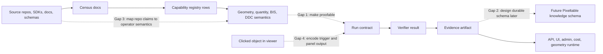

# InfraNodus Gap Analysis - 2026-05-13

Status: first controlled gap-analysis artifact

Input scope: curated docs from `meta/capability-research/inventory/corpus-manifest.yaml`

Output status: research material only, not harness proof and not capability promotion

## Tool And Skill Inputs

This pass used the local InfraNodus MCP server and the following local skill
lenses:

| Source | Use |
|---|---|
| `.claude/skills/skills-master/infranodus-cli/SKILL.md` | Tool catalog and MCP workflow reference |
| `.claude/skills/skills-master/skill-shifting-perspective/SKILL.md` | Structural diagnosis workflow |
| `.claude/skills/skills-master/skill-ontology-creator/SKILL.md` | Future schema-vocabulary lens |
| `.claude/skills/skills-master/skill-actionize/SKILL.md` | P0/P1/P2 task-shaping pattern only |
| `/Users/ojeromyo/.agents/skills/graphify/SKILL.md` | Graphify output expectations and repo-wide caution |

Graphify and GitNexus were loaded only for readiness/status. They were not run
over the repo.

Current status checks:

| Tool | Result |
|---|---|
| InfraNodus | MCP available and used for this report |
| Graphify | Installed at `/Users/ojeromyo/.local/bin/graphify` |
| GitNexus | Installed at `/opt/homebrew/bin/gitnexus`, version `1.6.3`; current repo reports `Repository not indexed` |

## InfraNodus Calls

| Tool | Purpose |
|---|---|
| `optimize_text_structure` | Diagnose discourse shape and main bridges |
| `generate_content_gaps` | Extract missing links between clusters |
| `difference_between_texts` | Compare current organization against desired operator workflow |

The analysis corpus was a compressed statement set from the curated docs, not a
full repo crawl. The temporary local corpus summary was about 16,551 words and
124,559 bytes.

## Structural Diagnosis

InfraNodus classified the current capability-research discourse as
`diversified`.

That is good news: the project is not stuck on one idea. The gap is now
connection quality. The docs already cover many domains, but several domains do
not yet have explicit bridges into deterministic proof, schema design, and the
operator workflow.

Main clusters identified:

| Cluster | Meaning |
|---|---|
| Geometry semantics | DDC, iTwin, BIS, quantity, UI semantics, Vectorworks geometry |
| Capability matrix | Capability state, harness, future knowledge tables, matrix rows |
| Evidence execution | Proof rows, evidence artifacts, admin/runtime execution |
| Repository analysis | Repo census, local docs, GitNexus, research organization |
| Schema workflow | Pixeltable, scripts, SDKs, plugins, ODBC, MCP |
| Cost reporting | Cost, BOQ, schedule, LCA, CWICR/Qdrant, reports |
| Operator landscape | Operator console, React/TanStack, AEC workflow |
| Source migration | Source boundaries, output manifests, migration guardrails |
| Data structure | IFC data, element identity, viewer objects, durable store |
| Contract verification | Run contracts, verifier, browser trigger, sidecar execution |

## Highest-Value Gaps

### 1. Geometry Semantics To Evidence Execution

InfraNodus' strongest gap was between:

```text
DDC/iTwin/BIS/Vectorworks geometry and quantity semantics
-> proof/evidence/runtime/admin execution
```

This is the core missing bridge. The matrix cannot just say a repo has
geometry, cost, or schema value. It needs to say exactly how a clicked element,
quantity, class, style, and geometry path become a bounded run contract and
evidence artifact.

Working rule:

```text
Vectorworks geometry + quantities
-> DDC/iTwin semantic mapping
-> operator panel contract
-> proof row
-> execution evidence artifact
-> admin/runtime validation
```

### 2. Evidence Execution To Schema Workflow

The docs describe proof gates and future Pixeltable knowledge tables, but the
bridge between evidence artifacts and future schema is still conceptual.

Before migration `0017`, define the evidence-to-schema shape:

```text
source artifact
-> harvested capability
-> operator workflow layer
-> proof contract
-> verifier result
-> evidence artifact
-> promotion event
```

Do not implement this schema yet. The next step is a design artifact with
candidate columns and examples from real registry rows.

### 3. Geometry Semantics To Repository Analysis

The repo census has useful sources, but source rows need a stronger mapping to
operator semantics:

| Source kind | Missing mapping |
|---|---|
| iTwin/BIS schemas | Which BIS class or quantity field appears in the panel? |
| Vectorworks scripts/plugins | Which object, record, class, style, worksheet, or ODBC field is extracted? |
| DDC/OpenConstructionERP/CWICR | Which element/quantity becomes a cost, BOQ, schedule, LCA, or report row? |
| UI component repos | Which click/select/edit interaction can be transferred into LATTICE? |
| ODBC drivers | Which data shape can be exported safely without becoming the durable store? |

### 4. Pricing/Geometry To Inventory Architecture

The desired Spark-like workflow is concrete: click an object, show cost, edit
size or quantity, update pricing, and eventually update geometry. The current
inventory does not yet encode this as a first-class mapping target.

Add an operator mapping section to future census and registry work:

```text
operator_trigger
selected_object_input
pixeltable_lookup
service_or_adapter
panel_output
editable_fields
evidence_required
runtime_destination
```

## Organization Gaps

| Gap | Current state | Needed next |
|---|---|---|
| Source acquisition policy | Repos are listed in census docs | Define clone/download/cache rules and license notes |
| Corpus expansion boundary | Curated docs are bounded | Define when external repos enter the corpus |
| Graphify first run | Installed, not executed for LATTICE | Create docs-only scoped proof output under `inventory/graphify/` |
| GitNexus first run | Installed, current repo not indexed | Index only `first_code_subset` after proof contract exists |
| Registry reconciliation | Graph tool registries exist but some paths are aspirational | Reconcile rows against actual files before promotion |
| Ontology extraction | Planned only | Create small BIS/DDC/VW/ODBC vocabulary fixture |
| Verifier contract | Described in readiness docs | Add deterministic verifier for this report shape |
| Pixeltable knowledge schema | Architecture candidates exist | Design later, after proof examples are stable |

## Recommended Task Plan

### P0 - Stabilize The First Graph-Analysis Proof

1. Add a deterministic run contract for `infranodus-curated-gap-analysis`.
2. Add a verifier that checks the report exists, includes conceptual gaps,
   includes organization gaps, includes P0/P1/P2 tasks, and includes no
   promotion claim.
3. Add a registry row for the InfraNodus gap-analysis capability in
   `analysis/capabilities/infranodus-capability-registry.yaml` if the existing
   row cannot represent this proof cleanly.
4. Run it through `/harness/capabilities`, not by arbitrary shell endpoint.
5. Write session evidence under `meta/harness/docs/sessions/`.

### P0 - Add Source Acquisition Policy

Create:

```text
meta/capability-research/inventory/source-acquisition-policy.md
```

It should define:

- when to clone versus download archives versus cite URLs only
- where source snapshots live
- what is excluded from Git
- how license provenance is recorded
- how prior local iteration directories are treated
- how repos become registry rows

### P0 - Add Operator Mapping Fields To Future Census Work

Every new capability row or census entry should answer:

```text
What operator action will invoke this?
What selected object or source artifact does it consume?
What Pixeltable lookup or future table does it need?
What API/UI/admin surface would expose it?
What proof artifact would make it trustworthy?
```

### P1 - Run Graphify Docs-First

After the InfraNodus proof is harnessed, run Graphify only against the curated
docs corpus and write output under:

```text
meta/capability-research/inventory/graphify/2026-05-13-docs-first/
```

Required output:

- HTML graph
- GraphRAG JSON
- plain-language report
- harness session artifact that cites command, corpus, output path, and result

### P1 - Run GitNexus Harness-Subset

After the Graphify docs proof, run GitNexus only on the `first_code_subset` from
the corpus manifest:

```text
pixeltable/service/routes/harness.py
pixeltable/service/main.py
scripts/audit-dead-dna.sh
scripts/check-python-docstrings.py
```

This should prove code-graph output location and indexing behavior before any
larger codebase analysis.

### P1 - Build The First Ontology Fixture

Create a small hand-verified vocabulary fixture covering:

- Vectorworks object identity: layer, class, style, record, worksheet, handle
- IFC/BIS identity: entity, class, subclass, placement, transform, quantity
- DDC cost identity: item, assembly, unit, region, BOQ row, schedule activity
- LATTICE proof identity: capability row, run contract, verifier result,
  evidence artifact, promotion event

This fixture should be source material for a later schema design pass, not a
schema migration.

### P2 - Design Pixeltable Knowledge Tables

Only after several proof artifacts exist, design migration `0017` around real
examples. Candidate tables remain:

```text
lattice/knowledge/source_repositories
lattice/knowledge/source_artifacts
lattice/knowledge/schema_vocabulary
lattice/knowledge/harvested_capabilities
lattice/knowledge/capability_relationships
lattice/harness/run_contracts
lattice/harness/verifier_results
lattice/harness/proof_evidence
lattice/harness/promotion_events
```

No migration should be written from this report alone.

## Gap Map



## Decision

Use this report as the first InfraNodus gap-analysis output. Do not promote any
capability from it yet.

The next implementation target should be a harnessed proof for this report
shape, then a docs-only Graphify run, then a small GitNexus code-subset run.
