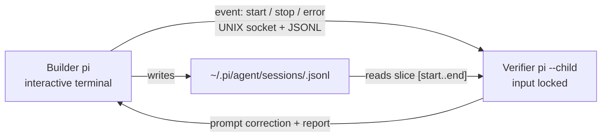

<!-- spec-verified: code.claude.com/docs 2026-05-11 -->
# Pi Delegation Surface

Pi is not outside LATTICE. Pi is an execution, delegation, and verification surface inside the LATTICE harness.

Source pattern incorporated into LATTICE doctrine: `disler/the-verifier-agent`.

## System hierarchy

| Layer | Meaning |
|---|---|
| LATTICE | Whole orchestration system and source of truth |
| Global Meta-Harness | Final verification, cross-harness coordination, evidence rollup |
| Section harnesses | Domain-specific docs, tests, diagrams, capability lifecycle, local improvement loops |
| Pi surface | Default harness task runner, script/prompt execution, interactive builder/verifier loop, model delegation, and correction-loop capability |
| Models | Claude, Codex, Copilot-backed flows, OpenAI, Anthropic, or other delegated capacity |

Pi lives under LATTICE the same way GitHub, Linear, Symphony, Graphify, GitNexus, Pixeltable, OpenRouter, Ollama, MLX, and local models live under LATTICE: it is a capability the system can dispatch through.

## Top-down observer pattern

Verifier mode uses Pi's top-down observer pattern:



Builder responsibilities:

- run the user's interactive task
- host the Unix socket server
- forward lifecycle events
- write the Pi session JSONL
- accept verifier correction prompts as follow-up input

Verifier responsibilities:

- run as `pi --child`
- keep terminal input locked
- use a read-only persona
- parse only the relevant JSONL slice for the turn
- emit a structured Report block
- send corrective feedback through the verifier prompt tool

Defense in depth:

- persona has no write/edit authority
- verifier bash is script-only
- verifier reads immutable or read-only evidence where possible
- verifier reports are evidence, not doctrine changes

## Adoption shape

| Layer | LATTICE responsibility | Pi responsibility |
|---|---|---|
| Builder/verifier loop | Decide when the loop is required and what evidence counts | Session JSONL observer, tmux sibling verifier, correction prompt transport |
| Model delegation | Choose task, context, model, and cost profile | Launch the selected model surface through Pi |
| Verifier persona | Encode LATTICE doctrine, hard rules, and harness checks | Run the selected persona/model |
| Deterministic checks | Own shell/Python scripts, CI jobs, GitHub/Linear checks | Invoke read-only commands through the verifier model |
| Evidence | Store reports, CI output, workpad comments, Pixeltable evidence tables when live | Emit verifier reports and corrective prompts |

## Minimum viable Pi surface

1. Add a LATTICE Pi verifier persona.
2. Point the persona at `scripts/lattice-verify.sh` as its first oracle.
3. Add domain scripts only when the verifier reports a repeated unverifiable gap.
4. Keep write/edit/delete tools unavailable to the verifier.
5. Feed verifier reports into the Global Meta-Harness evidence rollup.
6. Add a one-shot delegation prompt command for small single-file harness jobs.

## Job types

| Job type | Example |
|---|---|
| Verification | Run `scripts/lattice-verify.sh`, inspect failures, prompt correction |
| Script execution | Run a Python/C++/docs/sync script once and return artifact evidence |
| Prompt command | Execute a bounded `/P` command against one input and one output target |
| Local model task | Route small classification/extraction work to Ollama, MLX, or another local model |
| Remote model task | Route higher-context work through OpenRouter or Claude CLI when local is insufficient |

## Script-only bash policy

Verifier bash should not be a general shell. It should call repo-owned verifier scripts:

```bash
bash scripts/lattice-verify.sh
bash scripts/audit-dead-dna.sh
uv run python scripts/<verify-or-check-script>.py
```

When a verifier needs a new command repeatedly, add a script and register it as a capability. Do not teach the verifier to improvise destructive shell workflows.

See `meta/harness/bash-safety.md` for the Disler bash safety ladder adopted by LATTICE. Verifier mode should target L5: no arbitrary bash, custom tools only.

## Model routing

Pi can delegate builder and verifier work to different models. LATTICE chooses the model based on cost, current context, blast radius, and availability.

| Blast radius | Verifier policy |
|---|---|
| docs-only | cheaper model acceptable when deterministic checks pass |
| scripts/CI | stronger model; require command evidence |
| migrations/schema | strongest model; require explicit protected-path proof |
| GitHub/Linear sync | strong model plus API/CLI evidence |

## Trial gate

Before Pi verification becomes mandatory, run a real trial on one PR and record:

- install friction
- model/provider requirements
- whether correction loops improve outcomes
- whether verifier reports are useful enough for PR review
- what LATTICE-specific scripts the verifier needed but lacked
